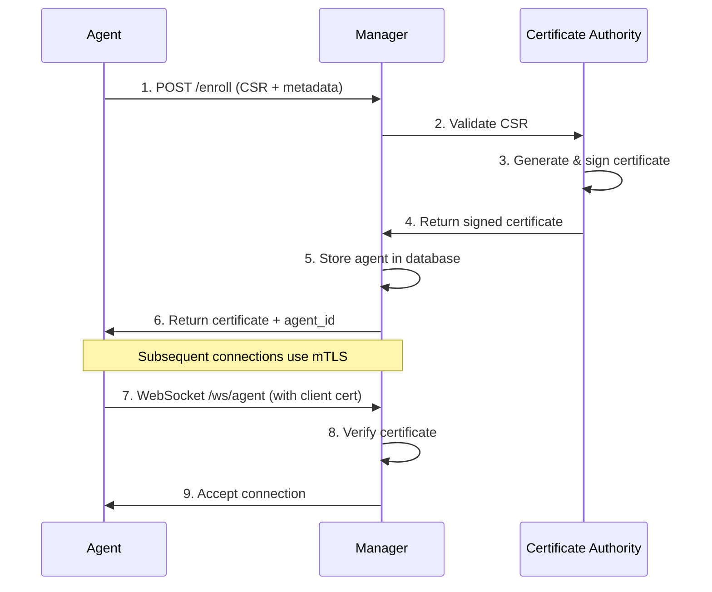

# RiskNoX Security Manager - Architecture & Design

## Overview

The RiskNoX Security Manager is a centralized command and control (C2) server that manages distributed security agents across an enterprise infrastructure. It replaces the current single-host architecture with a scalable, production-ready management platform.

## System Architecture

```mermaid
graph TB
    subgraph "Agent Fleet"
        A1[Agent 1<br/>Windows]
        A2[Agent 2<br/>Linux]
        A3[Agent N<br/>macOS]
    end
    
    subgraph "Manager Infrastructure"
        LB[Load Balancer<br/>nginx/HAProxy]
        M1[Manager Instance 1]
        M2[Manager Instance 2]
        
        subgraph "Data Layer"
            PG[(PostgreSQL<br/>Primary)]
            PGR[(PostgreSQL<br/>Replica)]
            RD[(Redis<br/>Cache & Queue)]
            S3[(S3/MinIO<br/>Artifacts)]
        end
        
        subgraph "Background Workers"
            C1[Celery Worker 1]
            C2[Celery Worker 2]
            CB[Celery Beat<br/>Scheduler]
        end
    end
    
    subgraph "Admin Interface"
        UI[Next.js Admin UI]
        MON[Monitoring<br/>Grafana/Prometheus]
    end
    
    A1 -.->|mTLS WebSocket| LB
    A2 -.->|mTLS WebSocket| LB
    A3 -.->|Fallback HTTP| LB
    
    LB --> M1
    LB --> M2
    
    M1 --> PG
    M2 --> PG
    M1 --> RD
    M2 --> RD
    M1 --> S3
    M2 --> S3
    
    RD --> C1
    RD --> C2
    RD --> CB
    
    UI --> LB
    MON --> M1
    MON --> M2
```



## Component Specifications

### Manager API Server
- **Technology**: FastAPI with uvicorn
- **Responsibilities**:
  - Agent enrollment via CSR processing
  - mTLS WebSocket connection management
  - Command creation and queuing
  - Real-time status monitoring
  - Admin API for UI integration

### Database Layer
- **Primary Database**: PostgreSQL 15+
  - Agent registry and metadata
  - Command history and status
  - Event logging and audit trails
  - Scheduled task configuration
- **Caching**: Redis 7+
  - Session storage
  - WebSocket connection state
  - Command queues (Celery backend)

### Message Queue
- **Technology**: Celery with Redis backend
- **Responsibilities**:
  - Asynchronous command processing
  - Scheduled task execution
  - Background data processing
  - Patch rollout orchestration

### Artifact Storage
- **Technology**: S3-compatible storage (MinIO for self-hosted)
- **Contents**:
  - Security patches and updates
  - Agent installation packages
  - Scan result archives
  - Configuration templates

## Security Architecture

### Agent Authentication


### Command Security
1. **Digital Signatures**: All commands signed with Manager private key
2. **Time-to-Live**: Commands expire automatically to prevent replay
3. **Agent Verification**: Agents verify command signatures before execution
4. **Audit Logging**: All command activity logged for compliance

### Certificate Lifecycle
- **Enrollment**: Automated CSR processing with metadata validation
- **Validity**: 90-day certificate lifetime with auto-renewal
- **Revocation**: CRL distribution for compromised certificates
- **Rotation**: Zero-downtime certificate updates

## Communication Protocols

### Primary: mTLS WebSocket
- **Port**: 8443 (HTTPS with WebSocket upgrade)
- **Authentication**: X.509 client certificates
- **Protocol**: JSON-RPC over WebSocket frames
- **Features**:
  - Real-time bidirectional communication
  - Server-initiated commands
  - Agent status heartbeats
  - Connection recovery with exponential backoff

### Fallback: Authenticated HTTP Polling
- **Port**: 8443 (HTTPS)
- **Authentication**: Certificate-based with JWT tokens
- **Endpoints**:
  - `GET /agents/{id}/commands` - Retrieve pending commands
  - `POST /agents/{id}/results` - Submit command results
- **Polling Interval**: 30 seconds default, configurable

## Database Schema

### Core Tables

```sql
-- Agent registry
CREATE TABLE agents (
    id UUID PRIMARY KEY,
    agent_id VARCHAR(36) UNIQUE NOT NULL,
    hostname VARCHAR(255) UNIQUE NOT NULL,
    status VARCHAR(20) DEFAULT 'enrolled',
    os_type VARCHAR(50) NOT NULL,
    os_version VARCHAR(100) NOT NULL,
    agent_version VARCHAR(20) NOT NULL,
    certificate_serial VARCHAR(40) UNIQUE NOT NULL,
    certificate_expires_at TIMESTAMP WITH TIME ZONE NOT NULL,
    last_seen_at TIMESTAMP WITH TIME ZONE,
    created_at TIMESTAMP WITH TIME ZONE DEFAULT NOW()
);

-- Command queue
CREATE TABLE commands (
    id UUID PRIMARY KEY,
    command_id VARCHAR(36) UNIQUE NOT NULL,
    agent_id UUID REFERENCES agents(id),
    command_type VARCHAR(50) NOT NULL,
    payload JSONB NOT NULL,
    signature TEXT NOT NULL,
    status VARCHAR(20) DEFAULT 'pending',
    priority INTEGER DEFAULT 5,
    expires_at TIMESTAMP WITH TIME ZONE NOT NULL,
    created_at TIMESTAMP WITH TIME ZONE DEFAULT NOW()
);

-- Event log
CREATE TABLE events (
    id UUID PRIMARY KEY,
    agent_id UUID REFERENCES agents(id),
    event_type VARCHAR(50) NOT NULL,
    event_data JSONB NOT NULL,
    severity VARCHAR(10) DEFAULT 'info',
    timestamp TIMESTAMP WITH TIME ZONE DEFAULT NOW()
);
```

## Deployment Architecture

### Development Environment
```yaml
# docker-compose.yml
services:
  manager:
    build: .
    ports: ["8000:8000"]
    environment:
      - DATABASE_URL=postgresql://...
      - REDIS_URL=redis://...
  
  postgres:
    image: postgres:15
    volumes: ["postgres_data:/var/lib/postgresql/data"]
  
  redis:
    image: redis:7
    volumes: ["redis_data:/data"]
```

### Production Deployment (Kubernetes)
```yaml
# manager-deployment.yaml
apiVersion: apps/v1
kind: Deployment
metadata:
  name: risknox-manager
spec:
  replicas: 3
  selector:
    matchLabels:
      app: risknox-manager
  template:
    spec:
      containers:
      - name: manager
        image: ghcr.io/risknox/manager:latest
        ports:
        - containerPort: 8000
        env:
        - name: DATABASE_URL
          valueFrom:
            secretKeyRef:
              name: manager-secrets
              key: database-url
        livenessProbe:
          httpGet:
            path: /api/v1/live
            port: 8000
        readinessProbe:
          httpGet:
            path: /api/v1/ready
            port: 8000
```

## Monitoring & Observability

### Metrics (Prometheus)
- **Agent Metrics**:
  - `manager_agents_total{status}` - Agent count by status
  - `manager_agent_connections_active` - Active WebSocket connections
  - `manager_agent_last_seen_seconds` - Time since last agent contact

- **Command Metrics**:
  - `manager_commands_total{type,status}` - Command count by type and status
  - `manager_command_duration_seconds` - Command execution time
  - `manager_command_queue_size` - Pending commands in queue

- **System Metrics**:
  - `manager_http_requests_total` - HTTP request count
  - `manager_websocket_connections_total` - WebSocket connection metrics
  - `manager_database_connections` - Database pool utilization

### Logging (Structured JSON)
```json
{
  "timestamp": "2025-09-27T15:30:00Z",
  "level": "INFO",
  "service": "manager",
  "event": "agent_enrolled",
  "agent_id": "550e8400-e29b-41d4-a716-446655440000",
  "hostname": "workstation-01",
  "ip_address": "192.168.1.100",
  "certificate_serial": "1a2b3c4d5e6f"
}
```

### Alerting Rules
- **Critical**: Agent disconnections > 5 minutes
- **Warning**: Command failure rate > 10%
- **Info**: Certificate expiration within 7 days

## Scalability Considerations

### Horizontal Scaling
- **Manager Instances**: Stateless design allows multiple replicas
- **Database**: Read replicas for analytics and reporting
- **Message Queue**: Redis Cluster for high availability
- **Storage**: Distributed object storage (S3/MinIO)

### Performance Targets
- **Agent Connections**: 10,000+ concurrent WebSocket connections per instance
- **Command Throughput**: 1,000+ commands per second
- **Response Time**: <100ms API response, <5s command delivery
- **Availability**: 99.9% uptime (planned maintenance windows)

## Security Considerations

### Network Security
- **TLS Everywhere**: All communication encrypted with TLS 1.3
- **Certificate Pinning**: Agents validate Manager certificate
- **Network Segmentation**: Manager in isolated network segment
- **Firewall Rules**: Restrictive ingress/egress policies

### Data Protection
- **Encryption at Rest**: Database and storage encryption
- **Encryption in Transit**: mTLS for all agent communication
- **Key Management**: Hardware Security Module (HSM) for production
- **Data Retention**: Configurable retention policies for logs and events

### Compliance
- **Audit Logging**: Complete audit trail for all operations
- **Role-Based Access**: Admin UI with granular permissions
- **Data Privacy**: GDPR/CCPA compliant data handling
- **Vulnerability Management**: Regular security assessments